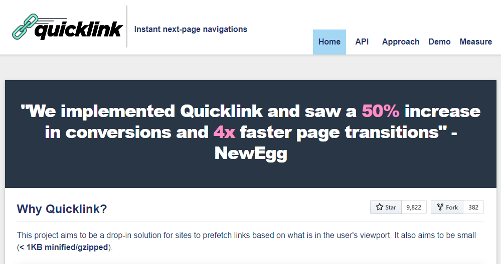

# 网页访问加速器

`基于谷歌quicklink的网页浏览加速器，加快网页打开速度，提升浏览体验`

## 加速原理

根据用户所在的视窗范围，识别出可以进行预加载的连接和资源，然后进行预加载，更详细的说明请参见[Quicklink](https://getquick.link/)官网。

## 特点

- 完全基于谷歌实验室团队出品的[Quicklink](https://github.com/GoogleChromeLabs/quicklink)
- 油猴脚本，方便跨浏览器使用
- 脚本透明，无访问追踪
- 可按需开启或关闭脚本

## 相关地址

- [Quicklink](https://getquick.link/)
- [Quicklink Github](https://github.com/GoogleChromeLabs/quicklink)
- [本项目作者的其他作品](https://greasyfork.org/zh-CN/users/291050-ankvps)

  
